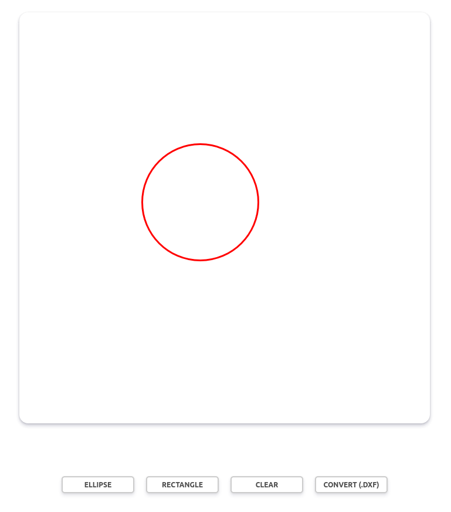

# SVG to DXF converter

SVG : Scalable Vector Graphics is an XML-based vector image format for defining two-dimensional graphics, having support for interactivity and animation.

DXF : is short for Drawing Exchange Format or Drawing Interchange Format and is a type of vector file. Engineers, designers and architects often use the DXF format for 2D and 3D drawings during product design.

## Preview 

## Tools
- HTML5, CSS3
- JavaScript
- Jquery
- Nodejs (ExpressJs)
- vectorexpress (https://www.npmjs.com/package/@vector-express/vectorexpress-nodejs)

## Run the project

Just clone / download the project to your local machine, and run :
- npm install
- npm start
- go to http://localhost:3000/